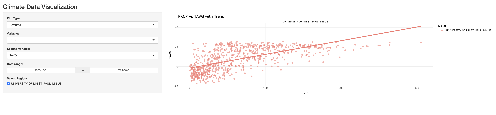

# Climate Visualization App



## Project Overview

This project is a Shiny web application designed for interactive climate data visualization. It allows users to explore various climate variables, including:

- **TAVG** (Average Temperature)
- **TMAX** (Maximum Temperature)
- **TMIN** (Minimum Temperature)
- **PRCP** (Precipitation)

The application provides two main types of analysis:

- **Time Series Analysis**: Visualize the selected climate variable over time, with a fitted linear trend and anomaly detection (points that deviate significantly from the trend).
- **Bivariate Analysis**: Explore the relationship between two selected climate variables, with a linear regression trend line to highlight patterns.

## Dataset

The dataset used for this project is the **Global Summary of the Month** dataset, which provides monthly weather summaries. The dataset includes important attributes such as temperature and precipitation levels for specific regions. The dataset was sourced from NOAA’s National Climatic Data Center (NCDC).

The `DATE` field was formatted from `YYYY-MM` into a proper date format for the analysis, and missing values were handled as appropriate during data filtering.

## Key Features

- **Interactive Filtering**: Users can filter data based on date range and specific regions.
- **Trend Detection**: Time series plots include a linear regression line to show trends over time.
- **Anomaly Detection**: The app flags anomalies (data points beyond two standard deviations) in the time series.
- **Dynamic Plotting**: Uses `ggplot2` for static plots and `plotly` for interactive visualizations, allowing zooming and hovering over data points.
- **Faceted Plots**: Visualize data trends across different regions by using faceted plots.

## Technology Stack

- **R**: Primary language used for building the app.
- **Shiny**: Framework for building interactive web applications.
- **ggplot2**: For generating static data visualizations.
- **plotly**: For transforming static plots into interactive visualizations.
- **dplyr**: For data manipulation and filtering.
- **lubridate**: For handling date formats and working with time series data.

## How to Run the App

1. Install the necessary R packages:
   ```R
   install.packages(c("shiny", "ggplot2", "dplyr", "plotly", "lubridate"))
   ```

2. Clone the repository and navigate to the project directory.

3. Run the Shiny app using the following command:
   ```
   Rscript climate_visualization.R
   ```

## Conclusion

This project demonstrates the power of R's Shiny framework combined with interactive visualizations to explore complex climate datasets. The app provides a flexible and user-friendly interface for analyzing climate trends, correlations between variables, and detecting anomalies across different regions.
